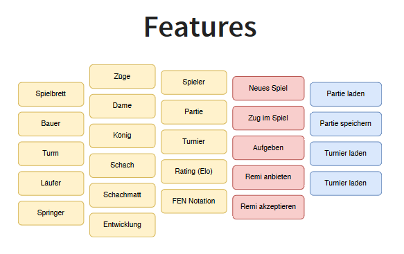

# CHESS - HWR OOP Lecture Project
This repository contains our (Alex, Maja, Felix, Gero, Laura) student project created for an ongoing lecture on object-oriented
programming with Java/Kotlin at HWR Berlin (summer term 2024).

> :warning: This code is for educational purposes only. Do not rely on it!

## Prerequisites

1. IDE of your choice installed (e.g. IntelliJ IDEA)
2. JDK of choice installed (e.g. through IntelliJ IDEA)
3. Maven installed (e.g. through IntelliJ IDEA)
4. Git installed

## Local Development

This project uses [Apache Maven][maven] as build tool.

To build from your shell (without an additional local installation of Maven), ensure that `./mvnw`
is executable:

```
chmod +x ./mvnw
```

We recommend not to dive into details about Maven at the beginning.
Instead, you can use [just][just] to build the project.
It reads the repositories `justfile` which maps simplified commands to corresponding sensible Maven
calls.

With _just_ installed, you can simply run this command to perform a build of this project and run
all of its tests:

```
just build
```

## Abstract

Objective of this project is to implement the game Chess while learning object-oriented programming with Java/Kotlin.

Chess is a game of skill for two players, each of whom moves 16 figures according to fixed rules across a board consisting 
of an eight-by-eight pattern of squares. Victory depends on concentration and intuitive vision. It is often called the royal game.

The chessboard is a miniature battlefield, and the opposing armies are called white and black. Each consists of eight 
so-called pieces—a king, a queen, two bishops, two knights, and two rooks —and eight pawns. \[...\] The object is to make a successful 
attack upon the enemy king. The king is not actually captured; it is enough to produce a position in which the king cannot escape. 
This situation is called a checkmate and ends the game. [^1]

MOST IMPORTANT FEATURES

MOST INTERESTING PROBLEMS WEVE STUMBLED UPON


## Feature List



[TODO]: # (For each feature implemented, add a row to the table!)

### Library

| Number | Implemented        | Feature      | Tests              |
|--------|--------------------|--------------|--------------------|
| 1      | :heavy_check_mark: | Chessboard   | :heavy_check_mark: |
| 2.1    | :heavy_check_mark: | Pawn         | :heavy_check_mark: |
| 2.2    | :heavy_check_mark: | Rook         | :heavy_check_mark: |
| 2.3    | :heavy_check_mark: | Bishop       | :heavy_check_mark: |
| 2.4    | :heavy_check_mark: | Knight       | :heavy_check_mark: |
| 2.5    | :heavy_check_mark: | Queen        | :heavy_check_mark: |
| 2.6    | :heavy_check_mark: | King         | :heavy_check_mark: |
| 3      | :x:                | Movement     | :x:                |
| 4      | :x:                | Check        | :x:                |
| 5      | :x:                | Checkmate    | :x:                |
| 6      | :x:                | Development  | :x:                |
| 7      | :x:                | Player       | :x:                |
| 8      | :x:                | Game         | :x:                |
| 9      | :x:                | Tournament   | :x:                |
| 10     | :x:                | Rating (ELO) | :x:                |
| 11     | :x:                | FEN Notation | :x:                |

### User Interface

| Number | Implemented | Feature     | Tests |
|--------|-------------|-------------|-------|
| 1      | :x:         | New Game    | :x:   |
| 2      | :x:         | Move Piece  | :x:   |
| 3      | :x:         | Resign      | :x:   |
| 4      | :x:         | Offer Remi  | :x:   |
| 5      | :x:         | Accept Remi | :x:   |

### Game Logistics??

| Number | Implemented | Feature         | Tests |
|--------|-------------|-----------------|-------|
| 1      | :x:         | Load Game       | :x:   |
| 2      | :x:         | Save Game       | :x:   |
| 3      | :x:         | Load Tournament | :x:   |
| 4      | :x:         | Save Tournament | :x:   |

## Additional Dependencies

[TODO]: # (For each additional dependency your project requires- Add an additional row to the table!)

| Number | Dependency Name | Dependency Description | Why is it necessary? |
|--------|-----------------|------------------------|----------------------|
| 1      | :x:             | :x:                    | :x:                  |


[maven]: https://maven.apache.org/
[just]: https://github.com/casey/just
[^1]: https://kids.britannica.com/students/article/chess/273625
