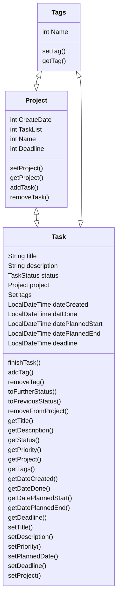

# HWR OOP Project - To-Do-List

This project is part of OOP with Paul, Benjamin, Jonas and Christian 2023

Yellow - Objects, classes, other java options
Red - Applications of project
Green - net to know - function of "gtd"

Starts with In-Tray -- "lose Gedanken welche keine wirklichen Tasks beinhaltet"

This repository contains a student project created for an ongoing lecture on object-oriented programming with Java at HWR Berlin (summer term 2023).

> :warning: This code is for educational purpose only. Do not rely on it!

## Abstract
To Do List
Features follow the "getting things done" method

[TODO]: # (Write a short description of your project.)
[TODO]: # (State most important features.)
[TODO]: # (State the most interesting problems you encountered during the project.)

## Flowchart

## Feature List

[TODO]: # (For each feature implemented, add a row to the table!)

| Number | Feature | Tests |
|--------|---------|-------|
| 1      | Task       | Implemented     |
| 2      | Project | Need Improvement     |
| 3      | Tags    | /     |
| 4      | Database| /     |

## Additional Dependencies

[TODO]: # (For each additional dependency your project requires- Add an additional row to the table!)

| Number | Dependency Name | Dependency Description | Why is it necessary? |
|--------|-----------------|------------------------|----------------------|
| 1      | Tag,Project,Task               | Need Dependencies between classes                      |                     |
